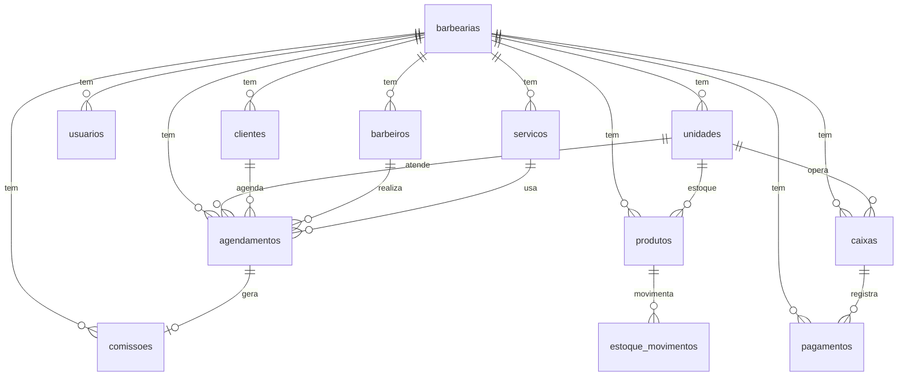

# Banco de dados — Barbearia SaaS

Schema multi-tenant (PostgreSQL via Flyway). Tenant = `barbearias`. Filiais = `unidades`.

## Tabelas principais (catálogo)

| Nome pedido | Implementação |
|-------------|---------------|
| `usuarios` | tabela `usuarios` |
| `clientes` | tabela `clientes` |
| `barbeiros` | tabela `barbeiros` |
| `servicos` | tabela `servicos` |
| `agendamentos` | tabela `agendamentos` |
| `pagamentos` | tabela `pagamentos` |
| `produtos` | tabela `produtos` |
| `estoque` | view `estoque` ← `produtos` (+ histórico em `estoque_movimentos`) |
| `fidelidade` | view `fidelidade` ← `fidelidade_saldos` (+ `fidelidade_config`, `fidelidade_movimentos`) |
| `comissoes` | tabela `comissoes` |
| `caixa` | view `caixa` ← `caixas` (+ `movimentos_caixa`) |
| `unidades` | tabela `unidades` (filiais/lojas) |

## Diagrama (núcleo)

## Migrations Flyway

| Versão | Conteúdo |
|--------|----------|
| V1 | barbearias, usuarios, clientes, barbeiros, agendamentos |
| V2 | portal cliente, servicos, avaliacoes |
| V3 | portal barbeiro, comissoes |
| V4 | recepção, caixas, pagamentos, movimentos_caixa |
| V5 | pagamento + serviço + data |
| V6 | fidelidade_* |
| V7 | produtos, estoque_movimentos |
| V8 | unidades, FKs `unidade_id`, views estoque/fidelidade/caixa |

## Ambientes

- **Produção / default:** PostgreSQL, `flyway.enabled=true`, `ddl-auto=validate`
- **Local (`local`):** H2 file, Flyway off, `ddl-auto=update` (Hibernate cria/atualiza entidades, inclusive `unidades`)

## API de unidades

- `GET/POST /api/unidades`
- `GET/PUT/DELETE /api/unidades/{id}`

No cadastro da barbearia, a unidade **Matriz** é criada automaticamente.
